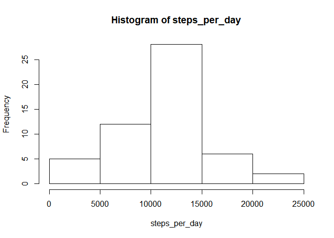
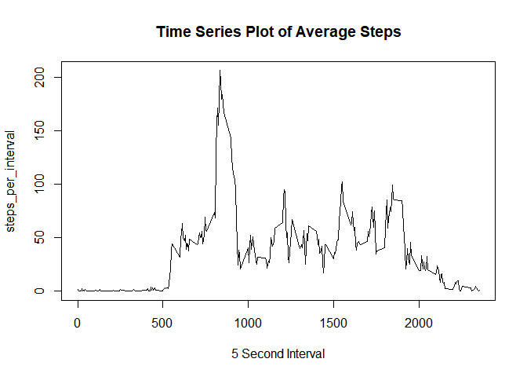
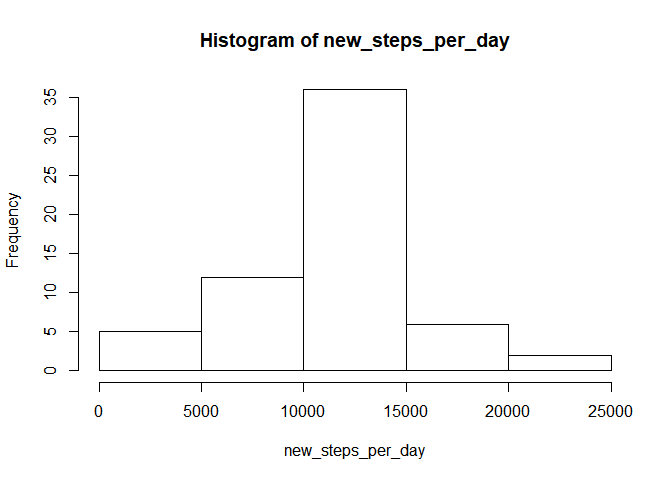
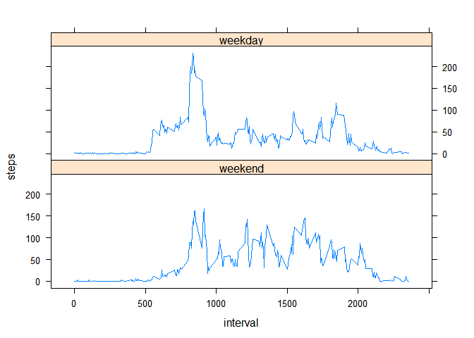

# Project 1 - Reproducible Research
Tom Goter  
January 19, 2018  


## Summary
This document goes through some simple data analysis and makes use of RMarkdown for creating a literate statistical program

### Step 1 - Read Data
This short chunk of code reads in the activity date and converts the date column into a date format.


```r
activityData <- read.csv("activity.csv")
activityData$date <- as.Date(activityData$date)
```

### Step 2 - Calculate Mean Number of Steps per Day
This chunk of code finds the mean number of steps taken per day.


```r
steps_per_day <- tapply(activityData$steps, activityData$date, sum)
hist(steps_per_day)
```

<!-- -->

```r
avgSteps <- mean(steps_per_day, na.rm = TRUE)
medianSteps <- median(steps_per_day, na.rm = TRUE)
```

The mean steps per day is 10766.19, and the median steps per day is 10765.

### Step 3 - Average Daily Activity Pattern
This chunk of code averages the step data across the days for each five second time interval.


```r
steps_per_interval <- tapply(activityData$steps, activityData$interval, mean, na.rm=TRUE)
plot(activityData$interval[1:length(steps_per_interval)],steps_per_interval,type="l",
     xlab = "5 Second Interval", main = "Time Series Plot of Average Steps")
```

<!-- -->

```r
maxInterval <- activityData$interval[which.max(steps_per_interval)]
```

On average the 5-second interval with the most amount of steps is interval number 835.

### Step 4 - Imputing Missing Values
This chunk of code tries to fill in missing data with the daily average.


```r
missingDataCount <- sum(is.na(activityData$steps))
newActivityData <- activityData
for (i in 1:length(activityData$steps)) {
    if (is.na(activityData$steps[i])) {
        interval <- i %% length(steps_per_interval)
        if (interval == 0) {interval = length(steps_per_interval)}
        newActivityData$steps[i] <- steps_per_interval[interval]
    }
}
new_steps_per_day <- tapply(newActivityData$steps, newActivityData$date, sum) 
hist(new_steps_per_day)
```

<!-- -->

```r
newAvgSteps <- mean(new_steps_per_day)
newMedianSteps <- median(new_steps_per_day)
```

There are 2304 missing step counts in the dataset.
After imputing missing values with the average by interval, 
the new mean steps per day is 10766.19, and the new median is 10766.19.

The mean value has not changed, but the median is now equal to the mean. There is no change to the total number of steps per
day for days without missing data.

### Step 5 - Weekday vs Weekend Pattern
This section of code is used to identify any patterns between weekday and weekend step counts.


```r
library(lattice)
library(reshape2)
wd_array <- c('Monday', 'Tuesday', 'Wednesday', 'Thursday', 'Friday')
newActivityData$dayType <- factor((weekdays(newActivityData$date) %in% wd_array), 
         levels=c(FALSE, TRUE), labels=c('weekend', 'weekday'))
wday_steps <- with(newActivityData, tapply(steps, list(interval,dayType),mean))
wday_steps2 <- melt(wday_steps)
colnames(wday_steps2) <- c('interval', 'dayType', 'steps')
with(wday_steps2, xyplot(steps ~ interval | dayType,type='l', layout=c(1,2)))
```

<!-- -->


